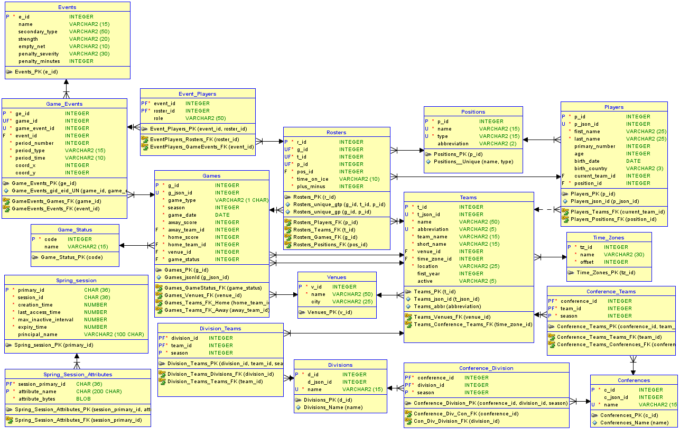

# NHLDataLoader_v2

## Improved version of NHLDataLoader

 Loads data from api (https://statsapi.web.nhl.com/api/v1/schedule?teamId=[teamid]&startDate=[date]&endDate=[date]) into class model using Gson library. 
    Now works with new api (https://api.nhle.com) that replaced statsapi (rip the old one and angry emote to the person, who decided to nuke it).
    Maps class models into hibernate entities.
    Stores data into Oracle database using Hibernate.

## Technologies

  - Java 8  
  - Oracle 19  
  - gson 2.8.2  
  - jpa 2.0  
  - hibernate 4.2.21  
  - json  

## Db scripts included in SQL script folder
db model:

## How to run
  

	This program is mostly for demo purposes on how I got the data, so to be honest, you probably don't run it :D
		 
	It is program created in the ancient times, where Spring or Maven was just some fancy words spoken by only the wisest of the wise. 
		 
	You would have to import libraries manually, have all the correct versions, change connection setting in hibernate.cfg config file to connect to your db and then load the schema, 
	which is quite the hasstle I wouldn't expect anyone to suffer through, plus it also needs some more optimizing to run more smoothly 
	(just for the info currently one game takes about 1.5 - 2 seconds to load). 
		 
	Which is also why I will have insert scripts in nhl app (which should be much more frendlier in terms of actually running it - uses Spring Boot and Maven) 
	with various amounts of games for easier and faster data populating.
  

## Description
  

	In main method write start year of desired season into seasonYear variable and if needed other variables for filtering purposes and application loads selected data into db.
	Program loads data from api using java.net.URL and HttpUrlConnection into Java objects which are then mapped to hibernate entities and stored into database. 
		   
	To prevent errors and potantialy storing same data twice, before storing data into database program checks, if said data aren't already stored and if so, it checks whether changes has been made to them based on unique keys or unique combination of columns. 
		  
	This will also be important later on when program will be handling live games, but for now trying to load game, that has already been loaded and stored into db won't cause any issues.
		   
	Note: later seasons have some changes in api, that make loading data from api fail, so keep to earlier seasons (2014/2015 - 2018/2019 is tested and should work) until I fix it :]
  
